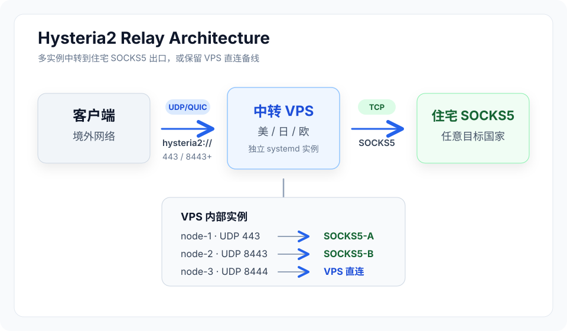

# Hysteria2 Relay

<p align="center">
  <strong>Hysteria2 一键部署脚本：VPS 中转到住宅 SOCKS5 出口，多节点、流量统计、邮件报警、终端二维码一次搞定。</strong>
</p>

<p align="center">
  <a href="https://github.com/superchaospc/hysteria2-relay/releases"></a>
  <a href="https://opensource.org/licenses/MIT"></a>
  <a href="https://www.gnu.org/software/bash/"></a>
  
</p>

<p align="center">
  <a href="./README.md">简体中文</a> · <a href="./README_EN.md">English</a> · <a href="https://github.com/superchaospc/hysteria2-relay/releases">Releases</a>
</p>

---

## 🚀 一键安装

```bash
curl -fsSL https://github.com/superchaospc/hysteria2-relay/releases/latest/download/hysteria2_deploy.sh -o /root/hysteria2_deploy.sh
chmod +x /root/hysteria2_deploy.sh
/root/hysteria2_deploy.sh
```

也可以安装到 `/usr/local/bin/`，以后直接输入 `hysteria2-relay` 打开菜单：

```bash
curl -fsSL https://github.com/superchaospc/hysteria2-relay/releases/latest/download/hysteria2_deploy.sh -o /usr/local/bin/hysteria2-relay
chmod +x /usr/local/bin/hysteria2-relay
hysteria2-relay
```

> ⚠️ **免责声明**：本项目仅供学习研究网络协议与系统运维使用。请用户遵守所在国家/地区的法律法规，自行承担使用后果。作者不对使用本脚本造成的任何直接或间接损失负责。

## ✨ 你会得到什么

- **多节点 Hysteria2 中转**：一台 VPS 跑多个独立 UDP 端口，每个端口对应一个住宅 SOCKS5 出口
- **systemd 实例隔离**：每个节点独立运行、独立重启，单节点异常不影响其他节点
- **BBR + UDP 调优**：自动启用 BBR 并调整 QUIC 需要的系统参数
- **流量统计 + 邮件报警**：查看 1 小时 / 今天 / 7 天 / 30 天流量，节点异常可自动重启并发邮件
- **扫码即导入**：自动生成 `hysteria2://` 链接和终端二维码，支持 Shadowrocket / NekoBox / v2rayNG / v2rayN；sing-box / Clash Meta 可按 Hysteria2 配置格式手动填写

## 📚 目录

- [适用场景](#-适用场景)
- [功能特性](#-功能特性)
- [架构](#️-架构)
- [首次部署流程](#首次部署流程)
- [菜单功能清单](#-菜单功能清单)
- [关键文件位置](#-关键文件位置)
- [常见问题](#-常见问题)
- [与 xray-relay 的关系](#-与-xray-relay-的关系)


## ⭐ 适用场景

这个脚本是为**特定流量模型**设计的，选对场景才能发挥它的优势。

### ✅ 推荐使用：客户端与中转 VPS 都在 UDP 友好的网络环境

Hysteria2 是 **UDP/QUIC** 协议，没有 TCP 回落。它的速度优势（基于 BBR 或 Brutal 拥塞控制）只有在客户端到 VPS 这一段 UDP 链路稳定时才能发挥出来。典型适用组合：

| 客户端位置 | 中转 VPS 位置 | 落地住宅 IP | 适用度 | 说明 |
|---|---|---|---|---|
| 日本 | 美西/美东 | 墨西哥/美国/欧洲/东南亚等境外住宅 | ⭐⭐⭐⭐⭐ | 跨太平洋海缆 UDP 稳定，BBR 收益明显 |
| 韩国 | 美西/日本 | 境外住宅 | ⭐⭐⭐⭐⭐ | 韩国国际出口 UDP 友好 |
| 新加坡/泰国/越南 | 美国/日本/欧洲 | 境外住宅 | ⭐⭐⭐⭐⭐ | 东南亚到主要中转地 UDP 通畅 |
| 北美 | 北美/欧洲 | 拉美/欧洲住宅 | ⭐⭐⭐⭐⭐ | 同大陆/跨大西洋 UDP 优秀 |
| 欧洲 | 欧洲/美国 | 境外住宅 | ⭐⭐⭐⭐ | 欧洲互联 UDP 稳定 |

> **落地节点限定为"境外住宅"**：本架构是「中转 VPS 主动连接落地 SOCKS5」的正向链路，适合 VPS → 境外住宅这种 TCP 出境通畅的方向。**不适合落地到中国大陆住宅**（详见下方 ❌ 章节）。

典型用例：

- **跨境账号管理**：境外开发者/运营从日本/新加坡管理墨西哥、巴西、土耳其等地的本地化账号，落地用对应国家的住宅代理
- **跨国电商客服**：客服坐席在第三国，对外展示本地 IP（落地国住宅）
- **数据采集 / 验证测试**：从合规地区出发，通过纯净住宅 IP 访问目标国家服务
- **个人隐私网络**：中转 + 境外住宅出口，比直连 VPS 数据中心 IP 更不容易被风控

### ❌ 不推荐使用：链路任一段在 GFW 管辖下，或落地到中国住宅

Hysteria2 在以下场景**性能远不如 VLESS+REALITY**，请使用我们的姐妹仓库 [`xray-relay`](https://github.com/superchaospc/xray-relay) 替代，或者考虑反向隧道架构：

| 场景 | 原因 |
|---|---|
| 客户端在中国大陆 → 境外 VPS | GFW 对境外高位 UDP 端口有 QoS 限速和主动干扰，丢包率高 |
| 中转 VPS 在中国大陆 | 国内 IDC 入境 UDP 普遍被丢包/限速；且大陆 IDC 跑代理服务有合规风险 |
| **落地到中国大陆住宅** | VPS → 国内住宅的出境 TCP 长连接质量差（国际出口 QoS、空闲断流），住宅 IP 频繁被境外 VPS 主动连接也容易被运营商打标签。需要"让目标看到中国 IP"的场景，应该用反向隧道架构（住宅主动连境外 VPS）替代 |
| 任一端涉及大陆运营商 UDP 跨境 | 同上，UDP 跨境质量远差于 TCP 443 |
| 强审查地区（伊朗、俄罗斯部分时段） | 部分地区会主动干扰 QUIC 流量，建议改用 VLESS+REALITY 走 TCP 443 |

**简单判断方法**：如果链路里任何一段流量需要穿过 GFW（无论方向），**不要用这个脚本**，去用 `xray-relay` 或者考虑反向隧道方案。

### 🎯 选型对照表

| 需求 | 推荐协议 | 仓库 |
|---|---|---|
| 客户端在中国大陆，落地住宅 | VLESS+REALITY | [xray-relay](https://github.com/superchaospc/xray-relay) |
| 客户端在境外，落地住宅，追求最高速度 | Hysteria2 | **本仓库** |
| 客户端在境外，落地住宅，追求兼容性/稳定性 | VLESS+REALITY | [xray-relay](https://github.com/superchaospc/xray-relay) |
| 中转 VPS 在中国大陆 | 都不推荐 | — |

---

## 🚀 功能特性

- **多节点共存**：一台 VPS 上跑多个 Hysteria2 实例，每个实例对应一个住宅 SOCKS5 落地（或 VPS 直连出口），互不干扰
- **每节点独立 systemd 实例**：基于官方 `hysteria-server@.service` 模板，单个节点挂掉不影响其他节点
- **VPS 直连节点**：菜单选项 12，部署一个不经过住宅 SOCKS5 的纯直连节点，流量直接从 VPS 机房 IP 出口（适合做应急备线 / 临时直连）
- **菜单化管理**：增删改查节点、修改端口、查看状态、流量统计、排错诊断、监控报警、更新 Hysteria2、卸载，全部通过交互式菜单完成
- **自动证书生成**：自签 ECC 证书 100 年有效期，所有节点共用，客户端 `insecure=1` 跳过验证（无需购买域名/申请 ACME）
- **BBR + UDP 缓冲区调优**：自动启用 BBR 拥塞控制，调整 `net.core.rmem_max` 等内核参数到适合 QUIC 的尺寸
- **流量统计**：基于 Hysteria2 内置 `trafficStats` API，每节点独立统计上下行流量，每 5 分钟落库，保留 60 天历史，支持「过去 1 小时 / 今天 / 过去 7 天 / 过去 30 天」分时段查询
- **监控报警**：邮件通知（支持 Gmail / QQ / 163 等 SMTP），支持节点掉线自动重启 + 报警去重（30 分钟内同一报警不重复发送）
- **终端二维码**：每次部署 / 添加 / 改端口后自动渲染 ANSI 二维码，扫码即导入到 Shadowrocket / NekoBox / v2rayNG / v2rayN
- **跨发行版兼容**：Debian / Ubuntu / CentOS / AlmaLinux / Rocky / Fedora 一键部署，自动识别 `apt` / `dnf` / `yum`
- **防火墙自动放行**：自动检测 UFW / firewalld / iptables 并放行节点的 UDP 端口
- **特殊字符安全**：SOCKS5 用户名/密码含 `:` `@` `#` `*` `"` `\` 等特殊字符也能正确写入 YAML 配置（用 JSON 字符串编码兜底）

---

## 🏗️ 架构



- 每个 `hysteria-server@node-N` 是独立的 systemd 实例，监听不同 UDP 端口
- 每个实例的配置文件是 `/etc/hysteria/node-N.yaml`，挂掉只影响自己
- 所有实例共享 `/etc/hysteria/certs/` 下的自签证书
- 节点元数据集中存在 `/etc/hysteria/.nodes_meta.json`，脚本所有增删改操作都通过它

**为什么是多 systemd 实例而不是单进程多 inbound？**
Hysteria2 协议本身是单进程单监听端口（不像 Xray 那样原生支持多 inbound）。多实例方案是官方推荐做法，配置隔离更清晰，单节点故障不会拖累其他节点。

---

### 首次部署流程

1. 选菜单 **1) 全新安装**
2. 脚本先准备系统依赖：默认只更新软件源并安装必要依赖；如需完整系统升级，可在提示时输入 `y`
3. 脚本继续完成：安装 Hysteria2 → 自签证书 → 系统优化（BBR + UDP 缓冲区）
4. 提示输入住宅 SOCKS5 节点（格式 `IP:PORT:USER:PASS`），可输入多个，每个一行，输入 `done` 结束
5. 如果暂时没有住宅 SOCKS5，可直接输入 `done`，脚本会询问是否创建一个 443 端口的 VPS 直连节点作为起点
6. 部署完成后自动显示每个节点的 `hysteria2://` 链接 + 终端二维码
7. 链接也保存在 `/root/hysteria_nodes_info.txt`，方便后续查看

---

## 📋 菜单功能清单

| 选项 | 功能 | 用途说明 |
|---|---|---|
| 1 | 全新安装 | 首次部署完整流程，含系统优化 |
| 2 | 添加节点 | 在现有部署上追加一个 SOCKS5 落地节点 |
| 3 | 删除节点 | 删除指定节点（停止 systemd 实例 + 删配置文件 + 移除元数据）|
| 4 | 修改端口 | 改某个节点的监听端口（自动放行防火墙 + 重启该实例 + 输出新链接）|
| 5 | 查看状态 | 列出所有节点的运行状态、BBR 状态、节点信息文件 |
| 6 | 流量统计 | 显示每节点的实时流量 + 1h/今天/7天/30天 历史聚合 |
| 7 | 排错诊断 | 8 项检查：实例状态 / 配置完整性 / 证书 / 端口监听 / 防火墙 / SOCKS5 连通性 / BBR / 系统资源 |
| 8 | 更新 Hysteria2 | 升级到最新版（保留所有节点配置不变）|
| 9 | 重启所有节点 | 一次性重启全部 `hysteria-server@node-*` 实例 |
| 10 | 监控报警 | 配置邮件通知 + 启停定时巡检（每分钟）|
| 11 | 卸载 | 完整清理（含 systemd / 配置 / 流量数据库 / 证书 / sysctl / 可选 swap）|
| 12 | 添加 VPS 直连节点 | 不经过 SOCKS5，流量直接从 VPS 机房 IP 出口（应急备线）|
| 0 | 退出 | — |

---

## 📁 关键文件位置

| 路径 | 说明 |
|---|---|
| `/etc/hysteria/.nodes_meta.json` | 所有节点元数据（端口/密码/落地/备注），脚本的"账本"|
| `/etc/hysteria/node-N.yaml` | 第 N 个节点的 Hysteria2 配置文件 |
| `/etc/hysteria/certs/cert.pem` | 自签证书（所有节点共用，100 年有效期）|
| `/etc/hysteria/certs/key.pem` | 自签私钥 |
| `/root/hysteria_nodes_info.txt` | 节点链接汇总（含 hysteria2:// 链接，方便复制）|
| `/root/.hysteria_traffic_db` | 流量历史数据库（管道分隔文本，按 idx 聚合）|
| `/root/.hysteria_monitor.conf` | 监控报警配置（SMTP 收件人、自动重启开关）|
| `/var/log/hysteria/monitor.log` | 监控日志（自动滚动到 10MB 后保留最后 5000 行）|
| `/etc/sysctl.d/99-hysteria.conf` | BBR + UDP 缓冲区内核参数 |
| `/etc/systemd/system/hysteria-server@.service.d/limits.conf` | 文件描述符限制提升 |

---

## ❓ 常见问题

**Q: 客户端连不上 / 速度很慢？**
先用菜单 7 跑一遍排错诊断。如果显示一切正常，最常见的原因是：
1. 客户端没填 `bandwidth` 或填得过高 — Hysteria2 的 Brutal 算法依赖客户端实测带宽，建议先用 `speedtest` 量出"客户端 → VPS"的真实速度，按 80% 填到客户端配置的 `up`/`down`
2. 客户端到 VPS 的 UDP 链路被运营商 QoS — 检查是不是用了 443 之外的高位端口，部分家用宽带对高位 UDP 不友好，换回 443 试试
3. 落地 SOCKS5 本身慢 — 用菜单 7 的连通性检查会显示落地 RTT，超过 200ms 就说明住宅代理本身就慢

**Q: 客户端导入提示"证书无效"？**
脚本用的是自签证书，客户端必须勾选 **"跳过证书验证"** / `insecure=1` / `skip-cert-verify: true`。生成的 `hysteria2://` 链接里已经带了 `&insecure=1`，扫二维码导入会自动设置。如果是手动复制 URL，注意别漏掉这个参数。

**Q: 我有 5 个住宅 SOCKS5，能在一台 VPS 上同时跑 5 个出口吗？**
可以。第一次部署时一行行输入 5 个节点（或者部署后用菜单 2 逐个添加），脚本会分配 443、8443、8444、8445、8446 五个 UDP 端口，每个端口对应一个住宅 SOCKS5 出口。客户端切换出口就是切换 VPS 的端口号。

**Q: SOCKS5 的密码里有 `:` 怎么办？**
脚本输入时用 `:` 做分隔符（`IP:PORT:USER:PASS`），所以 SOCKS5 的用户名和密码本身不能含 `:`。如果你的提供商给的密码含 `:`，可以联系他们换一个，或者部署后手动编辑 `/etc/hysteria/.nodes_meta.json`。其他特殊字符（`@` `#` `*` `"` `\` 空格等）脚本会用 JSON 字符串编码安全写入 YAML，无需处理。

**Q: Hysteria2 跟 VLESS+REALITY 比，速度真的快吗？**
**取决于场景**：
- 跨太平洋长肥管道（日/韩 → 美西）：Hysteria2 通常快 30-50%（BBR 在高 RTT 链路上效率显著优于 TCP）
- 同大陆短链路（欧洲互联、北美内部）：差距很小，可能只快 5-10%
- 任一端在大陆：**Hysteria2 反而慢**，因为 GFW 对境外 UDP 不友好

如果你不确定，先两个仓库都部署测一下，挑快的用。

**Q: 想把 sing-box / Clash Meta 当客户端，能用吗？**
可以，但不要把“协议支持”和“扫码导入 `hysteria2://`”混为一谈。sing-box 支持 Hysteria2 outbound，需要写成 `type: "hysteria2"` 的 JSON 配置；Clash Meta 也需要按它自己的 Hysteria2 节点格式填写。脚本输出的 `hysteria2://` 链接更适合 Shadowrocket / NekoBox / v2rayNG / v2rayN 等支持该分享 URI 的客户端扫码或粘贴导入。

**Q: 防火墙问题怎么排查？**
菜单 7 排错诊断会自动检测 UFW / firewalld / iptables 三种防火墙是否放行了节点的 UDP 端口。如果显示未放行：
- UFW: `ufw allow 443/udp`
- firewalld: `firewall-cmd --permanent --add-port=443/udp && firewall-cmd --reload`
- 云厂商安全组：去控制台手动放行 UDP 入站

**Q: 一个 VPS 跑几个节点合适？**
Hysteria2 单节点 CPU 占用比 Xray 高（QUIC 用户态实现 + 加密 + 拥塞控制都吃 CPU）。低端 1C512M VPS 单节点跑满速时 CPU 经常 50%+，建议：
- 1C1G：1-2 个节点
- 2C2G：3-5 个节点
- 4C4G+：5-10 个节点
节点数主要不是被内存限制，而是被 CPU 限制。

**Q: 部署在中国 VPS 上落地境外住宅，行不行？**
**强烈不建议**。中国 IDC 入境 UDP 普遍被丢包/限速，Hysteria2 性能会很差；而且大陆 IDC 跑代理服务有合规风险（机器被锁、IP 被封、严重的实名信息上报）。这种场景请用 [`xray-relay`](https://github.com/superchaospc/xray-relay) 走 VLESS+REALITY (TCP 443)。

**Q: 想让目标网站看到中国 IP，落地到中国住宅可以吗？**
**用这个脚本不合适**，原因有三点：
1. **链路方向不对**：本脚本是「中转 VPS 主动连接落地 SOCKS5」的正向架构，VPS → 国内住宅的出境 TCP 长连接受国际出口 QoS 影响，速度和稳定性都差
2. **住宅风险**：国内住宅 IP 频繁被境外 VPS 主动连接，容易被运营商打标签、限速甚至断网
3. **架构选错**：这种"境外客户端 → 中国 IP 出口"的需求，正确做法是**反向隧道**——让国内住宅机器主动连接境外 VPS 建立隧道，客户端连境外 VPS 后流量从隧道末端的国内住宅出去。常见方案是 frp、nps、gost 反向代理、WireGuard 反向连接等。或者直接购买商业回国线路（京东云/阿里云回国专线、回国 IP 代理服务）。

---

## 🔄 与 xray-relay 的关系

本仓库是 [`xray-relay`](https://github.com/superchaospc/xray-relay) 的姐妹项目，菜单结构、命名风格、监控/流量统计架构完全对齐，主要差异：

| 维度 | xray-relay (VLESS+REALITY) | hysteria2-relay (本仓库) |
|---|---|---|
| 协议 | TCP + TLS 伪装 (REALITY) | UDP/QUIC (Hysteria2) |
| 核心 | Xray-core | Hysteria2 |
| 进程 | 单进程多 inbound | 多 systemd 实例（每节点一个）|
| 配置 | 单文件 `/usr/local/etc/xray/config.json` | 多文件 `/etc/hysteria/node-N.yaml` |
| 抗审查能力 | 强（伪装 HTTPS）| 弱（QUIC 特征明显）|
| 速度（无审查环境）| 标准 | 通常快 30-50% |
| 适合场景 | 翻墙、客户端在 GFW 内 | 跨境账号管理、客户端在境外 |
| 抗 UDP QoS | 不受影响（TCP）| 受影响 |

如果你不确定该用哪个，参考前面的「适用场景」表格，或者两个都部署、A/B 对比之后留快的那个。

---

## 📝 License

MIT

## 🙋 作者

Wayne Shen ([@superchaospc](https://github.com/superchaospc))

---

> ⚠️ **再次强调**：本项目仅供学习研究使用。请勿用于违反所在国家/地区法律法规的用途。任何使用本脚本造成的后果由使用者自行承担，作者不负任何法律责任。
